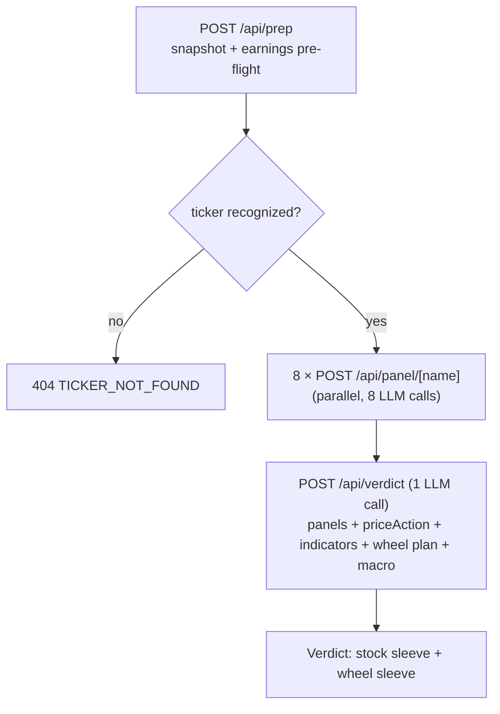

# stock-analysis

A wheel-entry desk for one ticker at a time. You bring a company you already want to own; the app answers **is this a good price, and where do I sell the put.**

It pulls moomoo OpenD (anomaly feeds, news, community sentiment, peers, Morningstar), yfinance (fundamentals + daily OHLCV), and Massive (SEC Form 4), runs each slice through its own LLM panel, and synthesizes a dual-sleeve verdict: a stock action and a wheel action.

**No broker integration**, deliberately — no account, NAV, cash, or position data, and it never asks for any. So both sleeves are **entry-or-pass on a fresh position**, and no output ever states a position size. Strike, expiry, and sizing happen at your broker. See `CLAUDE.md` for the full trading profile.

## Run it

Two processes. moomoo OpenD must be running on `127.0.0.1:11111`.

```bash
cd python_backend && ./run.sh   # FastAPI sidecar (from ~/.moomoo-venv)
pnpm dev                        # Next app -> localhost:3000
```

Tests: `pnpm test` (vitest, wheel logic) and `cd python_backend && pytest` (indicator math; needs `pip install -r requirements-dev.txt`). Both run on every push and PR via `.github/workflows/tests.yml`, alongside `tsc --noEmit` and `eslint`.

### Environment

In `.env.local` — see `src/lib/env.ts`:

| Var | Purpose |
|---|---|
| `OPENROUTER_API_KEY` | LLM provider. `OPENROUTER_MODEL` defaults to `google/gemini-3.1-flash-lite-preview` |
| `GEMINI_API_KEY` | Web-grounded surfaces (Stock Digest, Macro briefing) |
| `MASSIVE_API_KEY` | SEC Form 4 insider data; degrades to "no activity" when unset |
| `PYBACKEND_URL` | Sidecar, default `http://localhost:8765` |

## Architecture



Each step renders as soon as it resolves. The **python sidecar owns all deterministic math** — indicators, levels, vol, and the option chain are computed in Python and cited verbatim; the LLM never recomputes them.

**Storage:** one SQLite file, `data/app.sqlite`, owned entirely by the sidecar (`store.py`). It caches yfinance daily bars so HV and price-action don't refetch per request. Fully rebuildable — delete it and the sidecar repopulates.

## Panels

Eight panels run in parallel, each one LLM call against a focused prompt.

| Panel | Source | Reads |
|---|---|---|
| **Fundamentals** | yfinance | Valuation, growth, margins, balance sheet, analyst targets, earnings + ex-div dates. The quality filter — and it matters more here than to a premium seller, since assignment means actually owning the company. |
| **Wheel Entry** | moomoo chain + yfinance | The expected move per expiry and the strikes beyond it, plus the acquisition zone and vol regime. No LLM call. See below. |
| **Technical** | moomoo `get_technical_unusual` + computed indicators | Anomaly *events* (K-line patterns, indicator crosses) plus standing *state*: RSI, MACD, Bollinger %B, SMA distances, ADX/±DI, a `regime` label, and `rsiDivergence`. The anomaly feed often reads 无异常 while the chart is plainly extended; the snapshot fills that gap. |
| **Capital** | moomoo `get_financial_unusual` | Capital distribution, broker flow, net in/outflow, short selling. |
| **News Flow** | moomoo news + Morningstar + peer graph | Headlines with URLs, Morningstar fair value / moat / bull-bear, and a sector peer read-through. |
| **Stock Digest** | Gemini, web-grounded | Broker reports and analyst notes; a live read on the near-term setup. |
| **Community Sentiment** | moomoo feed | Retail tone — a contra-indicator at extremes. |
| **Insider Flow** | SEC Form 4 via Massive | Discretionary buys/sells only; routine 10b5-1 plan sales are discounted. |

## The wheel read

Three deterministic pieces, computed before any LLM sees them.

**Acquisition zone** (`src/lib/wheel/zone.ts`) — the band of prices worth owning at, bracketed from three anchors: analyst target-low, SMA200, and nearest swing support. Each is reported individually so you can dismiss one. A put strike below the band is a *good* acquisition price, inside is *fair*, above is *rich* — you'd be overpaying to get assigned. The call leg inverts: above the band is good, because you're selling richly.

**Vol regime** (`/vol/regime`) — HV30 with its own trailing-1-year percentile, plus ATM IV and IV/HV, labelled `rich` / `fair` / `thin`. This is a **proxy for IV Rank, not IV Rank**: no available source carries historical implied vol, so the percentile ranks *realized* vol. Everything that surfaces it says so. Thin premium is a downgrade, never a veto — a wheeler who wants the shares is simply paid less to wait.

**Strike tables** (`/options/wheel-chain` + `src/lib/wheel/score.ts`) — expiries near 21/30/45 DTE, each showing the 1-SD expected move and **only the strikes beyond it**, nearest the band edge first, capped at 8. The expected move *is* the filter: it's computed per expiry from that expiry's own ATM IV, since vol is DTE-specific. Each row carries delta, bid, mid, zone position, whether it clears support/resistance, and:

- **annualized yield %** = `mid/basis × 365/dte`, where basis is the strike on the put leg (cash secured) and spot on the call leg (shares already owned) — size-independent either way, so it says nothing about position size

Liquidity is **not** a gate: a thin far-OTM strike is still a legitimate entry, so OI and spread aren't filtered on. An expiry with earnings inside its window is dropped outright, in code. There's deliberately **no composite score** and no "best strike" mark — further out is safer and pays less, and that tradeoff is the read.

This panel makes **no LLM call**. It's arithmetic from IV to band to the strikes beyond it; the verdict synth reads the same table.

## How the verdict is reasoned

One LLM call reads all eight panels; `src/lib/gemini/synth.ts` enforces a strict order. Two guards are **also enforced deterministically in code**, so a model that argues around the prompt still gets overridden.

1. **No portfolio data** — entry-or-pass only, never a size, both wheel legs state their unverified prerequisite. A `stripSizingPhrases()` pass scrubs any "% NAV" prose that slips through.
2. **Acquisition price** — the primary gate. Every reasonable strike above the zone → PASS, direction bearish. The company may be fine; the price isn't.
3. **Falling-knife guard** — softened for this strategy. A **severe** breakdown (below the 200d plus a gap or volume blowout) forbids a new put: that's thesis damage, not a discount. A **mild** one warns and allows, with the strike required below the zone floor — an investor who wants the shares is partly buying the dip. A breakout blocks the *call* leg only.
4. **Regime gate** — an oscillator extreme is momentum, not a reversal. Oversold inside a downtrend (ADX ≥ 20) is continuation, not a bottom; only a `range` regime mean-reverts on its own, and `rsiDivergence` is what upgrades an extreme into a real turn.
5. **Vol regime** — a bonus that moves confidence, never a gate.
6. **Strike placement** — every row it sees already clears the expected move; the conservative edge is one that *also* sits below the zone floor and support. Further out is safer and pays less, and the rationale must pick a side of that with a reason.
7. **Earnings** — a mandatory cite on every verdict. Expiries with earnings inside the window never reach the model: `score.ts` drops them.  Ex-div inside the window flags early-assignment risk on short calls.
8. **Rationale must quote numbers** — specific figures from the panels, at least one fundamentals reference, and any guard that fired named with its values.

Each sleeve carries its **own confidence on its own clock**: stock is the multi-quarter thesis, wheel is "is this price a good entry". A 75% long-term hold at a 45% entry is the normal split between a good company and a good price — not disagreement, and never averaged.

## What it deliberately doesn't do

No broker connection, position tracking, trade journal, P&L, or ticker screener. No roll or exit advice — it can't see a position. No advice on managing anything you already hold.
