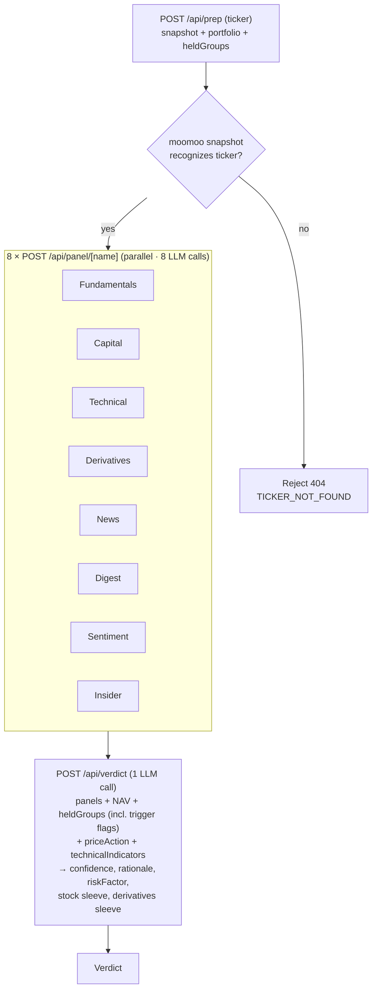

# stock-analysis

A portfolio-aware stock & options analysis dashboard. Pulls data from IBKR (positions, account summary, trade history), moomoo OpenD (option chain, capital/technical/derivatives anomalies, news, community sentiment, peers), yfinance (fundamentals + daily OHLCV), and Massive — the vendor formerly known as Polygon (SEC Form 4 insider transactions). It runs each slice through a per-skill LLM panel and synthesizes a single dual-sleeve verdict (stock action + derivatives action) sized to the user's actual NAV. The app stops at the verdict — strike/expiry selection and order entry happen in IBKR/TWS directly; the journal records the trades after the fact.

The desk is tuned for a **conservative, credit-only options book** (defined-risk premium selling — no naked or debit positions). See `CLAUDE.md` for the full trading profile.

## Run it

Two processes: the Next.js app and the python sidecar (a FastAPI wrapper around moomoo-api + yfinance that also computes the deterministic indicators). moomoo OpenD must be running locally on `127.0.0.1:11111`; the IBKR Client Portal Gateway must be authenticated for portfolio/positions.

```bash
# terminal 1 — python sidecar (runs from ~/.moomoo-venv)
cd python_backend && ./run.sh

# terminal 2 — next app
pnpm dev
```

Open http://localhost:3000.

### Environment

Set in `.env.local` (Next app) — see `src/lib/env.ts`:

- `OPENROUTER_API_KEY` — LLM provider (OpenAI-compatible). `OPENROUTER_MODEL` defaults to `google/gemini-3.1-flash-lite-preview`.
- `IBKR_BASE_URL` — Client Portal Gateway (default `https://localhost:5001`); `IBKR_FLEX_TOKEN` + `IBKR_FLEX_QUERY_ID` for trade-history sync via the Flex Web Service.
- `MASSIVE_API_KEY` — SEC Form 4 insider data (panel degrades gracefully to "no activity" when unset).
- `PYBACKEND_URL` — python sidecar (default `http://localhost:8765`).

---

## Data layers

- **IBKR Client Portal** — live positions, account summary, ledger (`src/lib/ibkr/client.ts`); **Flex Web Service** for historical trade sync feeding the P&L calendar (`src/lib/ibkr/flex.ts`).
- **moomoo OpenD** — option chain (Lv1 greeks/quotes), the three anomaly feeds (capital/technical/derivatives), news, digest, community feed, and peer graph. Reached via the python sidecar and `src/lib/moomoo/httpApi.ts`.
- **yfinance (via sidecar)** — fundamentals plus daily OHLCV (cached in SQLite). The OHLCV is what powers the **deterministic, server-computed** layers: technical indicators, the IV/HV vol summary, and the price-action signal. These are computed in Python and cited verbatim — never inferred by the LLM.
- **Massive (ex-Polygon)** — SEC Form 4 insider buys/sells (`src/lib/massive/insider.ts`).

LLM calls go through OpenRouter's `/chat/completions` (`src/lib/gemini/client.ts`); the `src/lib/gemini/` directory name is historical.

---

## Panels

Each panel is a structured analyst read on one slice of the picture. The eight panels run in parallel, each one its own LLM call against a focused prompt.

### Fundamentals — `src/lib/gemini/panels/fundamentals.ts`

Source: yfinance via `/fundamentals` on the python sidecar.

Reads the long-horizon "is this a quality company" view. Categories cited in bullets: **[Valuation]** (P/E trailing & forward, PEG, P/B, P/S), **[Growth]** (revenue YoY, earnings YoY, earnings QoQ — flags decelerating growth even when absolute numbers still beat), **[Profitability]** (profit margins, operating margins, ROE; flags negative margins and FCF burn), **[Balance sheet]** (debt-to-equity, free cash flow, total cash, current ratio), **[Analyst view]** (recommendationKey, target mean price vs current — % upside/downside, number of analyst opinions), **[Calendar]** (next earnings date — flagged if within ~10 days because IV will crush after the print).

Meta row (4 stats): forward P/E, revenue YoY, profit margin, next earnings date.

Direction is `bullish` when growth >10% YoY + profitable + analyst buy + price not extended; `bearish` when growth negative or decelerating, OR margins compressing, OR debt-to-equity high while FCF negative; `mixed` for contradictory signals; `n/a` for ETFs and small caps where yfinance returns mostly nulls.

### Capital Anomaly — `src/lib/gemini/panels/capital.ts`

Source: moomoo `get_financial_unusual` (last 30 days by default).

Three classes of capital-flow anomaly: 资金分布与买卖经纪商 (capital distribution + buy/sell brokers), 资金流向 (net inflow/outflow), 卖空情况 (short selling). Bullish when major capital is net inflowing, supportive brokers buying, falling shorts. Bearish on persistent outflow, short-ratio spikes, smart-money exit. Each bullet preserves dates, amounts, ratios, broker names from the underlying tool — the model is not allowed to invent thresholds.

### Technical Anomaly — `src/lib/gemini/panels/technical.ts`

Sources: moomoo `get_technical_unusual` (last 30 days) **plus** a server-computed indicator snapshot from yfinance daily OHLCV (`/technical/indicators` on the sidecar).

Two distinct things, merged in one panel:

- **Anomaly EVENTS** (moomoo): K-line patterns + indicator crosses — CCI, KDJ, RSI, BIAS, ARBR, VR, PSY, OSC, WMSR, MACD, BOLL, MA. These fire only on a *new* cross/breakout inside the window.
- **Standing STATE** (deterministic, cited verbatim): current RSI(14), MACD/signal/hist, Bollinger %B, distance vs SMA20/50/200, 52w-high proximity, recent returns — and the **regime/divergence overlay**: ADX(14) with +DI/−DI, a `regime` label (`strong_uptrend` / `uptrend` / `range` / `downtrend` / `strong_downtrend`), and `rsiDivergence` (`bearish` / `bullish` / `none`). The anomaly feed often reads 无异常 even when the chart is plainly overbought/oversold — the snapshot fills that gap.

The regime/divergence overlay exists to stop the "overbought → sell calls / oversold → buy the dip" reflex: an oscillator extreme inside a trending regime (ADX ≥ 20) is treated as **momentum continuation**, not exhaustion, unless RSI divergence confirms a rollover. Only in a `range` regime (ADX < 20) does an extreme read as a standalone mean-reversion fade. The verdict synth enforces the same gate — see "Decision flow".

### Derivatives Breakdown — `src/lib/gemini/panels/derivatives.ts`

Sources: moomoo `get_derivative_unusual` (last 30 days) **plus** a server-computed structured vol snapshot (`/options/vol-summary` — moomoo chain ATM IV + yfinance realized HV).

- **Anomaly EVENTS** (moomoo): PCR (put/call ratio), IV percentile, large block trades, smart-money detection, put/call skew callouts, CBBC street-share for HK names.
- **Vol snapshot** (deterministic, cited verbatim): ATM IV (call + put legs, by strike), HV30 and HV60 (sqrt(252)-annualized), the **IV/HV ratio**, and 25Δ skew (put IV @ Δ≈−0.25 minus call IV @ Δ≈+0.25). The model must quote these numbers rather than infer "IV is high" from the anomaly prose — these server numbers also flow into the verdict's vega decision.

This panel is the primary driver for the (credit-only) derivatives sleeve. The verdict synth is required to read its IV regime + IV-HV + skew before picking a strategy — see "Decision flow".

### News Flow — `src/lib/gemini/panels/news.ts`

Sources: moomoo news search on the ticker (last ~12 items, sorted by publish time) **plus** a sector **peer read-through** — news collated across the ticker's moomoo peer graph.

Headlines + URLs + recency, preserved verbatim and clickable in the UI. The peer read-through surfaces sector-wide moves (a supplier guidance cut, a competitor's print) that a single-ticker news scan would miss. Direction is the dominant news sentiment, weighted to the ticker itself with peers as context.

### Insider Flow — `src/lib/gemini/panels/insider.ts`

Source: SEC Form 4 filings via Massive (ex-Polygon).

Recent insider buys/sells — who (officer/director/10% owner), how much, at what price, and net direction. Cluster buying by multiple insiders is a stronger bullish tell than a single transaction; routine 10b5-1 sells are discounted. Degrades to "No insider activity" when the data source is unavailable or the key is unset (never fails the run).

### Stock Digest — `src/lib/gemini/panels/digest.ts`

Source: moomoo's "digest" news view — typically broker reports, analyst notes, and longer-form research items as opposed to the breaking-news flow.

### Community Sentiment — `src/lib/gemini/panels/sentiment.ts`

Source: moomoo community/feed posts on the ticker.

Aggregates retail discussion tone — bullish / bearish / neutral counts, plus the meta row of post counts. Useful as a contra-indicator at extremes (everyone bullish on retail forums = caution).

---

## Decision flow

The page orchestrates three routes per ticker analysis. `/api/prep` is the fail-fast gate; the eight panel calls fan out in parallel from the client, then the verdict synthesizes them. Each step renders into the UI as soon as it resolves — no one big bundled response.



**HeldGroup auto-detection** runs server-side in `/api/prep` (and client-side on initial portfolio load) via `src/lib/positions/groups.ts`: legs are bucketed by `(underlying, expiry)` and pattern-matched into `BULL_PUT_SPREAD`, `BEAR_CALL_SPREAD`, `COVERED_CALL`, `CSP`, `LONG_CALL`, etc. Each group then gets `pt50Hit`, `dteUnder21`, `stopBreached` trigger flags (tastytrade defaults: 50% PT, 21 DTE, 2× credit stop on credits / 50% debit stop on debits) plus a rule-based `suggestion` (HOLD / CLOSE / ROLL_OUT / ROLL_OUT_AND_DOWN / ROLL_OUT_AND_UP). The verdict synth reads these as facts and either matches the suggestion or explains its divergence.

### How the verdict is reasoned (stage 3)

The synth prompt frames the model as the head PM at an institutional desk running a barbell portfolio (~50% stock, ~50% defined-risk derivatives). It enforces a strict decision order:

1. **Direction is shared between sleeves**, but the *action* on each sleeve is independent. Stock and derivatives can disagree only as an explicit hedge (e.g. trim stock + buy puts), and the rationale must explain why.

2. **Conviction is a single 0-100 score** describing the directional read. 50 = coin flip, >75 = strong, 90+ = rare. Both sleeves share it.

3. **Stock sleeve action ∈ {OPEN, INCREASE, TRIM, HOLD, CLOSE, PASS}**:
   - If the user already holds shares → INCREASE / TRIM / HOLD / CLOSE.
   - If user holds option legs but no stock → PASS (don't double-stack exposure) unless the stock thesis is independently strong.
   - If user holds nothing → OPEN (when conviction ≥60 + decisive direction) or PASS.

4. **Falling-knife / momentum guard (HIGHEST PRIORITY — checked first)**. The payload's server-computed `priceAction` block (`/price-action`, yfinance daily OHLCV) classifies the tape as `breakdown` / `breakout` / `none`. This is a HARD gate against the single worst conservative-trader mistake: selling premium *into* the move.
   - `priceAction.signal === "breakdown"` → `SELL_PUT_SPREAD` and `SELL_CASH_SECURED_PUT` are FORBIDDEN as new entries (don't sell downside premium into a confirmed breakdown). Default PASS; only `SELL_CALL_SPREAD` if the bearish thesis is independently clean. The rationale must quote a concrete `reasons` item (e.g. "9.2% below 50d MA, 7 consecutive down days").
   - `priceAction.signal === "breakout"` → mirror logic: `SELL_CALL_SPREAD` / `SELL_COVERED_CALL` forbidden into a melt-up.
   - This gate **outranks** the technical panel: an oversold-rebound "bullish" technical read does not override an active breakdown.

5. **Overbought/oversold regime gate** (reads the `technicalIndicators` block — `regime`, `adx14`, `+DI`/`−DI`, `rsiDivergence`). An oscillator extreme is a *momentum* reading, not a reversal:
   - Trending regime (ADX ≥ 20) with no confirming divergence → the extreme is **continuation**. An overbought-in-uptrend must NOT create/reinforce a `SELL_CALL_SPREAD` fade (the call-side falling knife); an oversold-in-downtrend must NOT create/reinforce a `SELL_PUT_SPREAD`/CSP "buy the dip" (the put-side falling knife, this user's signature mistake).
   - `range` regime (ADX < 20) → the only place an oscillator extreme legitimately mean-reverts on its own.
   - `rsiDivergence` (`bearish` at a high / `bullish` at a low) is what *upgrades* an extreme into an actionable counter-trend fade — and only if the panels already agree. Otherwise the oscillator is a sizing/extension caution, never a direction flip.

6. **Derivatives sleeve — credit-only, volatility before direction**. The book carries **no debit or naked structures**. The full menu: `SELL_PUT_SPREAD` (bullish credit), `SELL_CASH_SECURED_PUT` (bullish, cash-permitting), `SELL_CALL_SPREAD` (bearish credit), `SELL_COVERED_CALL` (bearish, ≥100 shares held), `IRON_CONDOR` (neutral, both wings must show IV > HV), `ROLL_OUT` (defensive). Strategy is gated by IV regime, then matched to the directional bias:
   - **IV percentile HIGH (>~70)** → credit is mathematically rich; match the credit trade to bias (bullish → CSP/`SELL_PUT_SPREAD`; bearish → covered call/`SELL_CALL_SPREAD`; strictly neutral → `IRON_CONDOR`). High IV does NOT default to bullish.
   - **IV percentile LOW (<~30)** → premium is cheap; PASS is acceptable on a marginal thesis. Only commit when conviction ≥70 with strong directional support.
   - **IV middle (~30-70)** → credit matched to bias when conviction ≥55; PASS if conviction <55 AND IV-HV is at parity.
   - **IV-HV check (tiered)**: ≥1.2× = required "premium is rich"; ≥1.5× = preferred; ≥2× = ideal, selling favored regardless of bias. <1.2× = treat as no premium.
   - **Skew check**: 25Δ put skew ≥ +0.03 → CSP collects fear premium; ≤ −0.03 → covered call / call spread collects right-tail premium.
   - **Leveraged ETFs**: for daily-reset 2x/3x products (TQQQ, SOXL, …) prefer the spread variants over CSP/covered call regardless of cash eligibility — daily-reset decay makes assignment a structurally bad outcome.

7. **Fundamentals as the quality filter**: a stock that screens bullish on flow + technicals but is fundamentally broken (negative FCF, decelerating growth, debt-to-equity > 3x) gets a conviction haircut. Fundamentals "neutral" on a name with strong technical/flow signals does NOT veto an entry — it just caps conviction. If `nextEarningsDate` is within ~10 days, prefer SHORT-vega income trades and ensure the chosen expiry clears the print (the user never holds a credit position through earnings).

8. **Eligibility hard rules** (server pre-computes `eligibility.{coveredCallEligible, cspEligible}` booleans — the synth trusts them, no re-math):
   - `coveredCallEligible === false` → `SELL_COVERED_CALL` forbidden; fall back to `SELL_CALL_SPREAD`.
   - `cspEligible === false` → `SELL_CASH_SECURED_PUT` forbidden (unfundable); fall back to `SELL_PUT_SPREAD`, citing the funds-required-vs-available numbers. **CSP-unfundable is never a PASS reason** — the spread has no cash gate.
   - `INCREASE / TRIM / HOLD / CLOSE` on the derivatives sleeve requires at least one existing OPT leg on this ticker; when multiple legs exist, the instruction must name which leg the action targets.
   - Options DTE: ~30-45 for new entries; income trades can extend to 45-60 for richer theta.

9. **Probability of Profit (POP) discipline**: credit spreads / income (short vega) target 65-80% POP and are the default at moderate conviction. The rationale must mention the POP regime (e.g. "CSP at 30Δ ≈ 70% POP").

10. **Sizing references actual NAV**: cap notional (strike × 100 × contracts) ≤ available cash for CSP, ≤ held shares for covered call; defined-risk spreads sized so max loss stays small vs NAV.

11. **Rationale must cite specific numbers from the panels** — no vague adjectives. At least one fundamentals reference is required when the fundamentals panel is non-`n/a`, and any guard/regime/eligibility gate that fired must be named with its numbers.

The flow ends at the verdict. Strike, expiry, and order entry happen in IBKR/TWS directly; the journal's `close-held` flow records trades after the fact.
