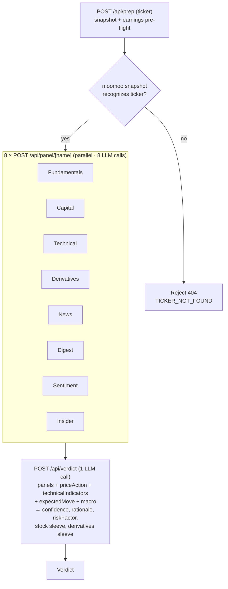

# stock-analysis

A stock & options analysis dashboard. Pulls data from moomoo OpenD (capital/technical/derivatives anomalies, news, community sentiment, peers), yfinance (fundamentals + daily OHLCV), and Massive — the vendor formerly known as Polygon (SEC Form 4 insider transactions). It runs each slice through a per-skill LLM panel and synthesizes a single dual-sleeve verdict (stock action + derivatives action). The app stops at the verdict — strike, expiry, sizing, and order entry all happen at your broker.

**No broker integration.** The app has no view of your account, NAV, cash, or open positions, and deliberately never asks for them. Both sleeves are therefore **entry-or-pass** calls on a fresh position: stock is `OPEN` or `PASS`; derivatives is one of the five credit structures or `PASS`. The verdict never states a position size — no share counts, no contract counts, no "% NAV" — because there is no portfolio to size against.

The desk is tuned for a **conservative, credit-only options book** (defined-risk premium selling — no naked or debit positions). See `CLAUDE.md` for the full trading profile.

## Run it

Two processes: the Next.js app and the python sidecar (a FastAPI wrapper around moomoo-api + yfinance that also computes the deterministic indicators). moomoo OpenD must be running locally on `127.0.0.1:11111`.

```bash
# terminal 1 — python sidecar (runs from ~/.moomoo-venv)
cd python_backend && ./run.sh

# terminal 2 — next app
pnpm dev
```

Open http://localhost:3000.

### Environment

Set in `.env.local` (Next app) — see `src/lib/env.ts`:

- `GEMINI_API_KEY` — the sole LLM provider (Google AI Studio). `GEMINI_STRUCTURED_MODEL` (panels + synth verdict) defaults to `gemini-2.5-flash-lite`; `GEMINI_GROUNDED_MODEL` (web-grounded Stock Digest + Macro) defaults to `gemini-2.5-flash`.
- `MASSIVE_API_KEY` — SEC Form 4 insider data (panel degrades gracefully to "no activity" when unset).
- `PYBACKEND_URL` — python sidecar (default `http://localhost:8765`).

---

## Data layers

- **moomoo OpenD** — the three anomaly feeds (capital/technical/derivatives), news, digest, community feed, and peer graph. Reached via the python sidecar and `src/lib/moomoo/httpApi.ts`.
- **yfinance (via sidecar)** — fundamentals (incl. next-earnings and ex-dividend dates) plus daily OHLCV. The OHLCV is what powers the **deterministic, server-computed** layers: technical indicators, the IV/HV vol summary (and the 1-SD expected move derived from its ATM IV), and the price-action signal. These are computed in Python/TS and cited verbatim — never inferred by the LLM.

### Storage

One SQLite file, `data/app.sqlite`, **owned entirely by the python sidecar**. It caches yfinance daily bars (`daily_closes` / `daily_ohlcv` + their sync logs) so HV and the price-action signal don't re-fetch on every request; the schema lives in `python_backend/main.py` (`_db_init`). The Next.js side no longer opens a database at all — the journal and Flex-sync tables that needed one are gone, along with the `better-sqlite3` dependency. The cache is fully rebuildable: delete the file and the sidecar recreates and repopulates it from yfinance.
- **Massive (ex-Polygon)** — SEC Form 4 insider buys/sells (`src/lib/massive/insider.ts`).

LLM calls go directly to the Google Gemini API via `@google/genai`: the structured, non-grounded panel/synth path (`src/lib/gemini/client.ts`, `gemini-2.5-flash-lite`) and the web-grounded Digest/Macro path (`src/lib/gemini/grounded.ts`, `gemini-2.5-flash`).

---

## Panels

Each panel is a structured analyst read on one slice of the picture. The eight panels run in parallel, each one its own LLM call against a focused prompt.

### Fundamentals — `src/lib/gemini/panels/fundamentals.ts`

Source: yfinance via `/fundamentals` on the python sidecar.

Reads the long-horizon "is this a quality company" view. Categories cited in bullets: **[Valuation]** (P/E trailing & forward, PEG, P/B, P/S), **[Growth]** (revenue YoY, earnings YoY, earnings QoQ — flags decelerating growth even when absolute numbers still beat), **[Profitability]** (profit margins, operating margins, ROE; flags negative margins and FCF burn), **[Balance sheet]** (debt-to-equity, free cash flow, total cash, current ratio), **[Analyst view]** (recommendationKey, target mean price vs current — % upside/downside, number of analyst opinions), **[Calendar]** (next earnings date — flagged if within ~10 days because IV will crush after the print; plus the ex-dividend date when within ~30 days, which the verdict uses to flag early-assignment risk on short calls).

Meta row (4 stats): forward P/E, revenue YoY, profit margin, next earnings date.

Direction is `bullish` when growth >10% YoY + profitable + analyst buy + price not extended; `bearish` when growth negative or decelerating, OR margins compressing, OR debt-to-equity high while FCF negative; `mixed` for contradictory signals; `n/a` for ETFs and small caps where yfinance returns mostly nulls.

### Capital Anomaly — `src/lib/gemini/panels/capital.ts`

Source: moomoo `get_financial_unusual` (last 30 days by default).

Three classes of capital-flow anomaly: 资金分布与买卖经纪商 (capital distribution + buy/sell brokers), 资金流向 (net inflow/outflow), 卖空情况 (short selling). Bullish when major capital is net inflowing, supportive brokers buying, falling shorts. Bearish on persistent outflow, short-ratio spikes, smart-money exit. Each bullet preserves dates, amounts, ratios, broker names from the underlying tool — the model is not allowed to invent thresholds.

### Technical Anomaly — `src/lib/gemini/panels/technical.ts`

Sources: moomoo `get_technical_unusual` (last 30 days) **plus** a server-computed indicator snapshot from yfinance daily OHLCV (`/technical/indicators` on the sidecar).

Two distinct things, merged in one panel:

- **Anomaly EVENTS** (moomoo): K-line patterns + indicator crosses — CCI, KDJ, RSI, BIAS, ARBR, VR, PSY, OSC, WMSR, MACD, BOLL, MA. These fire only on a *new* cross/breakout inside the window.
- **Standing STATE** (deterministic, cited verbatim): current RSI(14), MACD/signal/hist, Bollinger %B, distance vs SMA20/50/200, 52w-high proximity, recent returns — and the **regime/divergence overlay**: ADX(14) with +DI/−DI, a `regime` label (`strong_uptrend` / `uptrend` / `range` / `downtrend` / `strong_downtrend`), and `rsiDivergence` (`bearish` / `bullish` / `none`). The anomaly feed often reads 无异常 even when the chart is plainly overbought/oversold — the snapshot fills that gap.

The regime/divergence overlay exists to stop the "overbought → sell calls / oversold → buy the dip" reflex: an oscillator extreme inside a trending regime (ADX ≥ 20) is treated as **momentum continuation**, not exhaustion, unless RSI divergence confirms a rollover. Only in a `range` regime (ADX < 20) does an extreme read as a standalone mean-reversion fade. The verdict synth enforces the same gate — see "Decision flow".

### Derivatives Breakdown — `src/lib/gemini/panels/derivatives.ts`

Sources: moomoo `get_derivative_unusual` (last 30 days) **plus** a server-computed structured vol snapshot (`/options/vol-summary` — moomoo chain ATM IV + yfinance realized HV).

- **Anomaly EVENTS** (moomoo): PCR (put/call ratio), IV percentile, large block trades, smart-money detection, put/call skew callouts, CBBC street-share for HK names.
- **Vol snapshot** (deterministic, cited verbatim): ATM IV (call + put legs, by strike), HV30 and HV60 (sqrt(252)-annualized), the **IV/HV ratio**, and 25Δ skew (put IV @ Δ≈−0.25 minus call IV @ Δ≈+0.25). The model must quote these numbers rather than infer "IV is high" from the anomaly prose — these server numbers also flow into the verdict's vega decision.

This panel is the primary driver for the (credit-only) derivatives sleeve. The verdict synth is required to read its IV regime + IV-HV + skew before picking a strategy — see "Decision flow".

### News Flow — `src/lib/gemini/panels/news.ts`

Sources: moomoo news search on the ticker (last ~12 items, sorted by publish time) **plus** a sector **peer read-through** — news collated across the ticker's moomoo peer graph.

Headlines + URLs + recency, preserved verbatim and clickable in the UI. The peer read-through surfaces sector-wide moves (a supplier guidance cut, a competitor's print) that a single-ticker news scan would miss. Direction is the dominant news sentiment, weighted to the ticker itself with peers as context.

### Insider Flow — `src/lib/gemini/panels/insider.ts`

Source: SEC Form 4 filings via Massive (ex-Polygon).

Recent insider buys/sells — who (officer/director/10% owner), how much, at what price, and net direction. Cluster buying by multiple insiders is a stronger bullish tell than a single transaction; routine 10b5-1 sells are discounted. Degrades to "No insider activity" when the data source is unavailable or the key is unset (never fails the run).

### Stock Digest — `src/lib/gemini/panels/digest.ts`

Source: moomoo's "digest" news view — typically broker reports, analyst notes, and longer-form research items as opposed to the breaking-news flow.

### Community Sentiment — `src/lib/gemini/panels/sentiment.ts`

Source: moomoo community/feed posts on the ticker.

Aggregates retail discussion tone — bullish / bearish / neutral counts, plus the meta row of post counts. Useful as a contra-indicator at extremes (everyone bullish on retail forums = caution).

---

## Decision flow

The page orchestrates three routes per ticker analysis. `/api/prep` is the fail-fast gate; the eight panel calls fan out in parallel from the client, then the verdict synthesizes them. Each step renders into the UI as soon as it resolves — no one big bundled response.



### How the verdict is reasoned (stage 3)

The synth prompt frames the model as the head PM at an institutional desk running a barbell book. It enforces a strict decision order:

0. **No portfolio data.** The prompt opens by telling the model it has no account, NAV, cash, or positions. That constraint drives three hard rules it must follow: entry-or-pass actions only, never state a size, and never assume the user holds shares/cash/options. `SELL_COVERED_CALL` and `SELL_CASH_SECURED_PUT` stay on the menu but their instruction must open by naming the unverified prerequisite ("Only if you hold at least 100 shares: …"). A `stripSizingPhrases()` pass in `synth.ts` scrubs any "% NAV" / contract-count prose the model emits anyway.

1. **Each sleeve has its own independent confidence** (0-100) on its own clock. `stock.confidence` is the multi-week-to-multi-quarter read; `derivatives.confidence` is the 30-45 DTE read, scored **only** on short-term signal agreement. Cross-horizon tension (long-term bullish + short-term bearish) is expected and must NOT lower derivatives confidence.

2. **Stock sleeve action ∈ {OPEN, PASS}**: OPEN when conviction ≥60 and direction is decisive; otherwise PASS.

3. **Falling-knife / momentum guard (HIGHEST PRIORITY — checked first)**. The payload's server-computed `priceAction` block (`/price-action`, yfinance daily OHLCV) classifies the tape as `breakdown` / `breakout` / `none`. This is a HARD gate against the single worst conservative-trader mistake: selling premium *into* the move. It is also enforced **deterministically in code** after the LLM responds (`synth.ts`), so a model that ignores the prompt still gets overridden to PASS.
   - `priceAction.signal === "breakdown"` → `SELL_PUT_SPREAD` and `SELL_CASH_SECURED_PUT` are FORBIDDEN (don't sell downside premium into a confirmed breakdown). Default PASS; only `SELL_CALL_SPREAD` if the bearish thesis is independently clean. The rationale must quote a concrete `reasons` item (e.g. "9.2% below 50d MA, 7 consecutive down days").
   - `priceAction.signal === "breakout"` → mirror logic: `SELL_CALL_SPREAD` / `SELL_COVERED_CALL` forbidden into a melt-up.
   - This gate **outranks** the technical panel: an oversold-rebound "bullish" technical read does not override an active breakdown.

4. **Overbought/oversold regime gate** (reads the `technicalIndicators` block — `regime`, `adx14`, `+DI`/`−DI`, `rsiDivergence`). An oscillator extreme is a *momentum* reading, not a reversal:
   - Trending regime (ADX ≥ 20) with no confirming divergence → the extreme is **continuation**. An overbought-in-uptrend must NOT create/reinforce a `SELL_CALL_SPREAD` fade (the call-side falling knife); an oversold-in-downtrend must NOT create/reinforce a `SELL_PUT_SPREAD`/CSP "buy the dip" (the put-side falling knife, this user's signature mistake).
   - `range` regime (ADX < 20) → the only place an oscillator extreme legitimately mean-reverts on its own.
   - `rsiDivergence` (`bearish` at a high / `bullish` at a low) is what *upgrades* an extreme into an actionable counter-trend fade — and only if the panels already agree. Otherwise the oscillator is a sizing/extension caution, never a direction flip.

5. **Derivatives sleeve — credit-only, volatility before direction**. The book carries **no debit or naked structures**. The full menu: `SELL_PUT_SPREAD` (bullish credit), `SELL_CASH_SECURED_PUT` (bullish, cash caveat stated), `SELL_CALL_SPREAD` (bearish credit), `SELL_COVERED_CALL` (bearish, shares caveat stated), `IRON_CONDOR` (neutral, both wings must show IV > HV), `PASS`. Strategy is gated by IV regime, then matched to the directional bias:
   - **IV percentile HIGH (>~70)** → credit is mathematically rich; match the credit trade to bias (bullish → CSP/`SELL_PUT_SPREAD`; bearish → covered call/`SELL_CALL_SPREAD`; strictly neutral → `IRON_CONDOR`). High IV does NOT default to bullish.
   - **IV percentile LOW (<~30)** → premium is cheap; PASS is acceptable on a marginal thesis. Only commit when conviction ≥70 with strong directional support.
   - **IV middle (~30-70)** → credit matched to bias when conviction ≥55; PASS if conviction <55 AND IV-HV is at parity.
   - **IV-HV check (tiered)**: ≥1.2× = required "premium is rich"; ≥1.5× = preferred; ≥2× = ideal, selling favored regardless of bias. <1.2× = treat as no premium.
   - **IV-HV discount guard**: IV/HV < ~0.9 means the market prices *less* movement than the stock is realizing — a credit seller is structurally underpaid. Default PASS, overridable only at conviction ≥75 with the short strike beyond both the level and the expected move. Like the falling-knife guard, this is **also enforced deterministically in code** after the LLM responds.
   - **Skew check**: 25Δ put skew ≥ +0.03 → put-side credit collects fear premium; ≤ −0.03 → call-side credit collects right-tail premium.
   - **Leveraged ETFs**: for daily-reset 2x/3x products (TQQQ, SOXL, …) prefer the spread variants over CSP/covered call — daily-reset decay makes assignment a structurally bad outcome.

6. **Fundamentals as the quality filter**: a stock that screens bullish on flow + technicals but is fundamentally broken (negative FCF, decelerating growth, debt-to-equity > 3x) gets a conviction haircut. Fundamentals "neutral" on a name with strong technical/flow signals does NOT veto an entry — it just caps conviction. If `nextEarningsDate` is within ~10 days, prefer SHORT-vega income trades and ensure the chosen expiry clears the print (the user never holds a credit position through earnings).

7. **Unverifiable prerequisites are never a PASS reason.** `SELL_PUT_SPREAD` and `SELL_CALL_SPREAD` have no cash gate and no shares gate — their risk is the spread width minus credit. A bullish-to-neutral thesis at conviction ≥55 routes to `SELL_PUT_SPREAD`; bearish-to-neutral routes to `SELL_CALL_SPREAD`. Uncertainty about whether the user has cash or shares is exactly what the spreads are for. Options DTE: ~30-45 for new entries; income trades can extend to 45-60 for richer theta.

8. **Expected move & strike placement** (reads the server-computed `expectedMove` block — the 1-SD implied range `spot × atmIv × √(dte/365)` over the ~30 DTE expiry). Since the option chain is no longer fed to the model, it does not pick exact strikes or quote a numeric POP; instead it reasons about *where* the safe short strike sits. The conservative edge is a short strike beyond **both** the support/resistance level **and** the 1-SD bound (`expectedMove.lower` for puts, `upper` for calls). When the relevant level sits *inside* the expected move, the technically-"safe" strike is statistically exposed → widen, cut size, or PASS. The rationale cites the move verbatim (e.g. "expected move ±$14.20 (±7.1%) over 33 DTE puts the 1-SD lower bound at $185.80, below support $188").

    **Ex-dividend early-assignment guard**: for new bearish entries when the fundamentals panel carries an ex-dividend date inside the expiry window, the synth prefers `SELL_CALL_SPREAD` (defined risk if assigned) over a covered call, and says to keep the short call comfortably OTM. Inert when no ex-div date is present.

9. **Rationale must cite specific numbers from the panels** — no vague adjectives. At least one fundamentals reference is required when the fundamentals panel is non-`n/a`, and any guard or regime gate that fired must be named with its numbers.

The flow ends at the verdict. Strike, expiry, sizing, and order entry all happen at your broker — the app deliberately holds no account state.

### What the app deliberately does not do

There is no broker connection, no position tracking, no trade journal, no P&L calendar, and no candidate screener. Those existed when the app was wired to Interactive Brokers and were removed with it. The one place held-position thinking survives is the **what-if expected-move calculator** on the derivatives sleeve: type the IV and DTE of an expiry you're eyeing and it computes the 1-SD range against live support/resistance, so you can check a short strike clears both bounds before you place it. It takes its inputs by hand and needs no account data.
