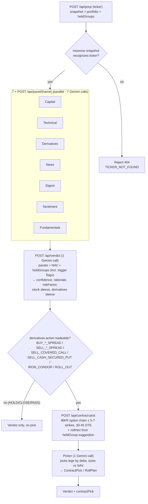

# stock-analysis

A portfolio-aware stock & options analysis dashboard. Pulls data from IBKR (positions, option chain), moomoo OpenD (capital flow, technical, derivatives anomalies, news, community sentiment), and yfinance (fundamentals), then runs each through a per-skill Gemini panel and synthesizes a single dual-sleeve verdict (stock action + derivatives action) sized to the user's actual NAV. When the derivatives sleeve picks a tradeable strategy, a downstream contract picker selects a specific multi-leg order.

## Run it

Two processes: the Next.js app and the python sidecar (FastAPI wrapper around moomoo-api + yfinance). moomoo OpenD must be running locally on `127.0.0.1:11111`; IBKR Client Portal Gateway must be authenticated.

```bash
# terminal 1 — python sidecar
cd python_backend && ./run.sh

# terminal 2 — next app
pnpm dev
```

Open http://localhost:3000.

---

## Panels

Each panel is a structured analyst read on one slice of the picture. They run in parallel, each one is its own Gemini call against a focused prompt.

### Fundamentals — `src/lib/gemini/panels/fundamentals.ts`

Source: yfinance via `/fundamentals` on the python sidecar.

Reads the long-horizon "is this a quality company" view. Categories cited in bullets: **[Valuation]** (P/E trailing & forward, PEG, P/B, P/S), **[Growth]** (revenue YoY, earnings YoY, earnings QoQ — flags decelerating growth even when absolute numbers still beat), **[Profitability]** (profit margins, operating margins, ROE; flags negative margins and FCF burn), **[Balance sheet]** (debt-to-equity, free cash flow, total cash, current ratio), **[Analyst view]** (recommendationKey, target mean price vs current — % upside/downside, number of analyst opinions), **[Calendar]** (next earnings date — flagged if within ~10 days because IV will crush after the print).

Meta row (4 stats): forward P/E, revenue YoY, profit margin, next earnings date.

Direction is `bullish` when growth >10% YoY + profitable + analyst buy + price not extended; `bearish` when growth negative or decelerating, OR margins compressing, OR debt-to-equity high while FCF negative; `mixed` for contradictory signals; `n/a` for ETFs and small caps where yfinance returns mostly nulls.

### Capital Anomaly — `src/lib/gemini/panels/capital.ts`

Source: moomoo `get_financial_unusual` (last 30 days by default).

Three classes of capital-flow anomaly: 资金分布与买卖经纪商 (capital distribution + buy/sell brokers), 资金流向 (net inflow/outflow), 卖空情况 (short selling). Bullish when major capital is net inflowing, supportive brokers buying, falling shorts. Bearish on persistent outflow, short-ratio spikes, smart-money exit. Each bullet preserves dates, amounts, ratios, broker names from the underlying tool — the model is not allowed to invent thresholds.

### Technical Anomaly — `src/lib/gemini/panels/technical.ts`

Source: moomoo `get_technical_unusual` (last 30 days).

K-line patterns + indicator events: CCI, KDJ, RSI, BIAS, ARBR, VR, PSY, OSC, WMSR, MACD, BOLL, MA. Detects breakouts, golden/death crosses, overbought/oversold, MA-stack changes. Drives the "is the chart confirming?" leg of conviction.

### Derivatives Breakdown — `src/lib/gemini/panels/derivatives.ts`

Source: moomoo `get_derivative_unusual` (last 30 days).

Options-flow + IV anomalies: PCR (put/call ratio), IV percentile, IV-HV spread (implied vs realized — when IV >> HV by 2x+, options market is overpaying for fear → selling premium favored regardless of direction), put/call skew, large block trades, smart-money detection, CBBC street-share for HK names.

This panel is the primary driver for the derivatives sleeve. The verdict synth is required to check it for IV regime + skew + IV-HV before picking a strategy — see "Decision flow" below.

### News Flow — `src/lib/gemini/panels/news.ts`

Source: moomoo news search (last ~12 items, sorted by publish time).

Headlines + URLs + recency. Each evidence item preserves the title and URL verbatim — clickable in the UI. Direction is the dominant news sentiment.

### Stock Digest — `src/lib/gemini/panels/digest.ts`

Source: moomoo's "digest" news view — typically broker reports, analyst notes, and longer-form research items as opposed to the breaking-news flow.

### Community Sentiment — `src/lib/gemini/panels/sentiment.ts`

Source: moomoo community/feed posts on the ticker.

Aggregates retail discussion tone — bullish / bearish / neutral counts, plus the meta row of post counts. Useful as a contra-indicator at extremes (everyone bullish on retail forums = caution).

---

## Decision flow

The page orchestrates four routes per ticker analysis. `/api/prep` is the fail-fast gate; the seven panel calls fan out in parallel from the client, then the verdict synthesizes them; the contract picker runs only when the verdict's derivatives action is tradeable. Each step renders into the UI as soon as it resolves — no one big bundled response.



**HeldGroup auto-detection** runs server-side in `/api/prep` (and client-side on initial portfolio load) via `src/lib/positions/groups.ts`: legs are bucketed by `(underlying, expiry)` and pattern-matched into `BULL_PUT_SPREAD`, `BEAR_CALL_SPREAD`, `COVERED_CALL`, `CSP`, `LONG_CALL`, etc. Each group then gets `pt50Hit`, `dteUnder21`, `stopBreached` trigger flags (tastytrade defaults: 50% PT, 21 DTE, 2× credit stop on credits / 50% debit stop on debits) plus a rule-based `suggestion` (HOLD / CLOSE / ROLL_OUT / ROLL_OUT_AND_DOWN / ROLL_OUT_AND_UP). The verdict synth reads these as facts and either matches the suggestion or explains its divergence.

### How the verdict is reasoned (stage 3)

The synth prompt frames the model as the head PM at an institutional desk running a barbell portfolio (~50% stock, ~50% defined-risk derivatives). It enforces a strict decision order:

1. **Direction is shared between sleeves**, but the *action* on each sleeve is independent. Stock and derivatives can disagree only as an explicit hedge (e.g. trim stock + buy puts), and the rationale must explain why.

2. **Conviction is a single 0-100 score** describing the directional read. 50 = coin flip, >75 = strong, 90+ = rare. Both sleeves share it.

3. **Stock sleeve action ∈ {OPEN, INCREASE, TRIM, HOLD, CLOSE, PASS}**:
   - If the user already holds shares → INCREASE / TRIM / HOLD / CLOSE.
   - If user holds option legs but no stock → PASS (don't double-stack exposure) unless the stock thesis is independently strong.
   - If user holds nothing → OPEN (when conviction ≥60 + decisive direction) or PASS.

4. **Derivatives sleeve — volatility before direction**. The strategy menu is gated by IV regime, not by direction:
   - **IV percentile HIGH (>70)** → MUST be SHORT or NEUTRAL vega. Pick `SELL_CASH_SECURED_PUT` (bullish, cash-permitting) or `SELL_PUT_SPREAD` (bullish, cash-light), `SELL_COVERED_CALL` (bearish/neutral, requires ≥100 shares held) or `SELL_CALL_SPREAD` (bearish/neutral, no shares), or `IRON_CONDOR` (strictly neutral, pure theta/IV-crush trade when both wings have IV > HV). NEVER pick a debit spread here — IV crush after the move can leave you flat or down even when direction is right.
   - **IV percentile LOW (<30)** → debit spreads are the right tool. `BUY_CALL_SPREAD` (bullish) or `BUY_PUT_SPREAD` (bearish).
   - **IV middle (30-70)** → tie-breaker on conviction × IV-HV spread. Default to credit (CSP / covered call / credit spreads) when conviction <70; default to debit only when conviction ≥75 + decisive direction.
   - **IV-HV check (mandatory)**: when IV >> HV by 2x+, selling premium is mathematically favored regardless of bias.
   - **Skew check**: elevated put skew → CSP collects fear premium; elevated call skew → covered call collects right-tail premium.
   - **Leveraged ETFs**: For daily-reset leveraged products (e.g., TQQQ, SOXL), prefer `SELL_PUT_SPREAD` or `SELL_CALL_SPREAD` over CSP / covered calls because daily-reset decay makes assignment a structurally bad outcome.

5. **Fundamentals as the quality filter**: a stock that screens bullish on flow + technicals but is fundamentally broken (negative FCF, decelerating growth, debt-to-equity > 3x) gets a conviction haircut. Fundamentals "neutral" on a name with strong technical/flow signals does NOT veto an entry — it just caps conviction. If `nextEarningsDate` is within ~10 days, the synth prefers SHORT-vega income trades over debit spreads regardless of direction (because IV crushes post-print).

6. **Eligibility hard rules**:
   - `SELL_COVERED_CALL` requires ≥100 shares held AND no existing short call already overwriting them (the prompt sees `coveredCallEligible` precomputed from the portfolio).
   - `INCREASE / TRIM / HOLD / CLOSE` on the derivatives sleeve requires at least one existing OPT leg on this ticker. When multiple legs exist (e.g. a spread), the instruction must name which leg the action targets.
   - Options DTE: ~30-45 for new entries; income trades can extend to 45-60 DTE for richer theta.

7. **Probability of Profit (POP) discipline**:
   - Debit spreads (long vega): 30-45% POP — only justify when conviction ≥75.
   - Credit spreads / income (short vega): 65-80% POP — default when conviction is moderate.
   - The rationale must mention the POP regime (e.g. "CSP at 30Δ ≈ 70% POP").

8. **Sizing references actual NAV**. For BUY spreads: cap max-loss-at-trade ≤ 0.5% NAV. For SELL income: cap notional (strike × 100 × contracts) ≤ available cash for CSP, ≤ held shares for covered call.

9. **Rationale must cite specific numbers from the panels** — no vague adjectives. At least one fundamentals reference is required when the fundamentals panel is non-`n/a`.

### How the contract is picked (stage 5)

The picker only fires when the derivatives action is `BUY_CALL_SPREAD`, `BUY_PUT_SPREAD`, `SELL_PUT_SPREAD`, `SELL_CALL_SPREAD`, `SELL_COVERED_CALL`, `SELL_CASH_SECURED_PUT`, or `IRON_CONDOR`. It receives the live IBKR option chain (greeks + bid/ask + OI) and picks legs by **delta**, not by strike:

- **Debit Spreads**: Long leg ATM (Δ 0.45-0.55) by default; 1-strike ITM (Δ 0.55-0.65) when conviction ≥80. Short leg ~30-delta OTM (Δ 0.20-0.35). Spread width is conviction-scaled.
- **Credit Spreads (inc. Iron Condor)**: Short leg ~15-20 delta OTM (defensive default). Long protective leg 5-20 strikes out depending on stock price ($50-$500+).
- **Income (Covered Call / CSP)**: Single short leg at ~15-20 delta OTM by default. Can step tighter if support/resistance aligns.
- Liquidity gate skips contracts where bid AND last are null, OI < 50, or (ask − bid) / mid > 0.10.
- Limit price = midpoint of bid/ask on the package; falls back to last when one side has no quote.

The picker uses **ONLY** contract codes that appear verbatim in the chain payload — it can't invent OCC codes. After the LLM returns its pick, a deterministic `fillLegFromChain` step overwrites the leg's numeric fields (delta, IV, theta, vega) with the chain's actual numbers, so the UI never shows model-hallucinated greeks.
